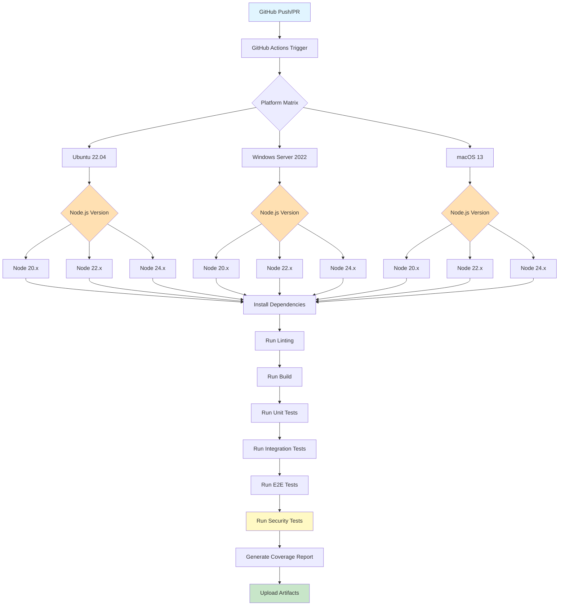
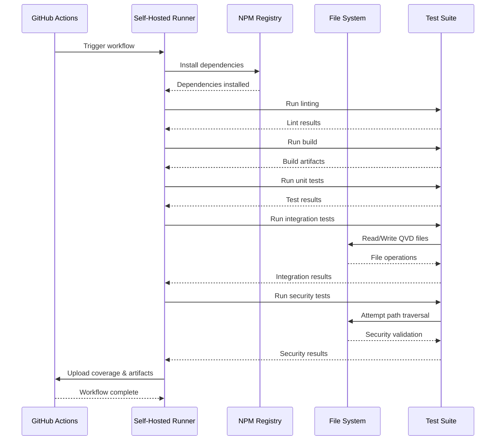

# Multi-Platform Test Solution Design for qvd4js

## Table of Contents

- [Overview](#overview)
- [Test Architecture](#test-architecture)
- [Test Categories](#test-categories)
- [Test Data Requirements](#test-data-requirements)
- [Platform Coverage](#platform-coverage)
- [GitHub Actions Workflow Design](#github-actions-workflow-design)
- [Self-Hosted Runner Requirements](#self-hosted-runner-requirements)
- [Security Testing](#security-testing)
- [Implementation Status](#implementation-status)
- [Success Metrics](#success-metrics)

## Overview

This document describes the comprehensive automated testing solution for the qvd4js library. The solution provides end-to-end testing across multiple platforms with a focus on reliability, security, and performance.

### Goals

1. **Comprehensive Coverage**: Test all library operations (read, write, modify)
2. **Multi-Platform Support**: Validate functionality on Windows, macOS, and Linux
3. **Security Hardening**: Ensure no path traversal vulnerabilities or malicious input handling issues
4. **Performance Validation**: Track performance metrics across platforms
5. **Automation**: Fully automated testing via GitHub Actions

### Current State

The repository currently has:

- **12 test suites** with **177 tests** covering:
  - Core functionality: Reader, Writer, basic operations
  - Security: Path security, buffer bounds, resource leaks
  - Validation: Input validation, error handling
  - Advanced features: Metadata, lazy loading, backwards compatibility, zero-value handling, cross-platform compatibility
- **Test data**: 4 QVD files (small: 606 rows, medium: 18,484 rows, large: 60,398 rows, damaged file)
- **Test coverage**: 92.24% statement coverage, 81.73% branch coverage
- **CI/CD**: Fully automated GitHub Actions workflow with multi-platform matrix testing
- **Build system**: tsup for dual ESM/CJS output
- **Test framework**: Jest with ESM support

## Test Architecture



### Test Execution Flow



## Test Categories

### 1. Core Functionality Tests

**Location**: `__tests__/*.test.js`

The test suite is organized into focused test files, each testing specific aspects of the library:

#### Reader Operations (`reader.test.js`)

- Parsing QVD files of various sizes (small, medium, large)
- Data integrity verification
- Error handling for corrupted files

#### Writer Operations (`writer.test.js`)

- Writing QVD files
- Data persistence verification
- Format correctness

#### Lazy Loading (`lazy-loading.test.js`)

- Loading files with `maxRows` limit
- Memory efficiency validation
- Partial data loading

#### Metadata Handling (`metadata.test.js`)

- File-level metadata access and modification
- Field-level metadata management
- Metadata persistence across write operations

#### Backwards Compatibility (`backwards-compatibility.test.js`)

- API compatibility verification
- Legacy code support
- Complete workflow validation (read → transform → write → verify)

#### Zero Value Handling (`zero-value-handling.test.js`)

- Edge cases with zero values in different data types
- Symbol type handling (dual integer, dual double, pure integer, pure double)

### 2. Security & Validation Tests

**Location**: `__tests__/*.test.js`

#### Path Security (`path-security.test.js`)

- Path traversal prevention (`../../` attacks)
- Absolute path validation with `allowedDir` restrictions
- Platform-specific path handling (Windows vs Unix)
- Null byte injection blocking
- Security error properties and context

#### Buffer Bounds Checking (`buffer-bounds.test.js`)

- Symbol table overflow protection
- Index table validation
- Negative offset and length rejection
- NaN value detection
- Corrupted file handling

#### Input Validation (`input-validation.test.js`)

- Method parameter validation (`head`, `tail`, `rows`, `at`, `select`)
- Type checking and error messages
- Edge case handling

#### Error Handling (`errors.test.js`)

- Custom error class hierarchy
- Error context information
- Error catching patterns
- Integration with real file operations

#### Resource Management (`resource-leak.test.js`)

- File descriptor leak prevention
- Concurrent operation safety
- Proper cleanup on errors

### 3. Cross-Platform Compatibility

**Location**: `__tests__/cross-platform.test.js`

- Case sensitivity handling across platforms (Windows, macOS, Linux)
- Path separator normalization
- Platform-specific path features (drive letters, UNC paths)
- Security validation consistency across platforms

### 4. Security Tests (New - Critical)

**Location**: `__tests__/security/*.test.js`

**Test Scenarios**:

#### Path Traversal Prevention

```javascript
describe('Security: Path Traversal', () => {
  test('Reject absolute path traversal in fromQvd', async () => {
    // Attempt: fromQvd('/etc/passwd')
    // Expect: Error thrown
  });

  test('Reject relative path traversal in fromQvd', async () => {
    // Attempt: fromQvd('../../etc/passwd')
    // Expect: Error thrown
  });

  test('Reject path traversal in toQvd', async () => {
    // Attempt: toQvd('../../../sensitive/file.qvd')
    // Expect: Error thrown or safe handling
  });

  test('Only allow QVD files in designated test directories', () => {
    // Verify paths are constrained to safe directories
  });
});
```

#### Malicious Input Handling

```javascript
describe('Security: Malicious Input', () => {
  test('Handle corrupted QVD file gracefully', async () => {
    // Load damaged.qvd
    // Expect: Proper error handling, no crashes
  });

  test('Handle extremely large field names', async () => {
    // Create QVD with 10MB field name
    // Expect: Validation error or safe truncation
  });

  test('Handle malicious XML in header', async () => {
    // Create QVD with XML injection attempt
    // Expect: Proper escaping/validation
  });

  test('Prevent buffer overflow in symbol table', () => {
    // Create QVD with oversized symbols
    // Expect: Safe handling
  });
});
```

#### Resource Exhaustion Prevention

```javascript
describe('Security: Resource Limits', () => {
  test('Limit memory usage for large files', async () => {
    // Load large file
    // Monitor memory usage
    // Expect: Memory stays within reasonable bounds
  });

  test('Timeout protection for slow operations', async () => {
    // Attempt operation on corrupted file
    // Expect: Timeout after reasonable duration
  });
});
```

### 5. Performance Tests (New)

**Location**: `__tests__/performance/*.test.js`

**Test Scenarios**:

#### Performance Benchmarks

```javascript
describe('Performance: Reading', () => {
  test('Small file (<100KB) loads in <250ms', () => {
    // Already exists in reader.test.js
    // Track across platforms
  });

  test('Medium file (~1MB) loads in <2500ms', () => {
    // Already exists in reader.test.js
    // Track across platforms
  });

  test('Large file (>1MB) loads in <5000ms', () => {
    // Already exists in reader.test.js
    // Track across platforms
  });

  test('Memory efficiency with lazy loading', () => {
    // Load 5GB file with maxRows: 100
    // Verify memory < 500MB
  });
});

describe('Performance: Writing', () => {
  test('Write operation completes in reasonable time', () => {
    // Write various file sizes
    // Track time across platforms
  });

  test('Write operations scale linearly', () => {
    // Write 1k, 10k, 100k row files
    // Verify O(n) complexity
  });
});
```

## Test Data Requirements

### Current Test Data

| File        | Size  | Rows   | Columns | Purpose                  |
| ----------- | ----- | ------ | ------- | ------------------------ |
| small.qvd   | 29KB  | 606    | 8       | Fast unit tests          |
| medium.qvd  | 901KB | 18,484 | 13      | Medium-scale integration |
| large.qvd   | 1MB   | 60,398 | 11      | Large-scale performance  |
| damaged.qvd | 20KB  | N/A    | N/A     | Error handling           |

### Additional Test Data Needed

| File                  | Size   | Purpose                                  |
| --------------------- | ------ | ---------------------------------------- |
| empty.qvd             | ~1KB   | Edge case: Zero rows                     |
| single_row.qvd        | ~2KB   | Edge case: Minimum data                  |
| all_types.qvd         | ~50KB  | All symbol types (int, float, str, dual) |
| unicode.qvd           | ~100KB | Unicode and special characters           |
| extra_large.qvd       | 50MB+  | Performance testing (optional)           |
| malformed_header.qvd  | ~10KB  | Security: Invalid XML header             |
| malformed_symbols.qvd | ~10KB  | Security: Invalid symbol table           |
| malformed_index.qvd   | ~10KB  | Security: Invalid index table            |
| max_columns.qvd       | ~500KB | Edge case: Many columns (100+)           |
| long_strings.qvd      | ~1MB   | Edge case: Very long string values       |

### Test Data Generation Strategy

1. **Synthetic Data**: Create programmatically using QvdDataFrame.fromDict()
2. **Real Data**: Use anonymized production QVD files (if available)
3. **Corrupted Data**: Manually corrupt valid QVD files for security testing
4. **Generated Once**: Store in `__tests__/data/` directory, commit to repo

## Platform Coverage

### Target Platforms

| OS             | Architecture | Node.js Versions | Runner Type |
| -------------- | ------------ | ---------------- | ----------- |
| Ubuntu 22.04   | x64          | 20.x, 22.x       | Self-hosted |
| Windows Server | x64          | 20.x, 22.x       | Self-hosted |
| macOS 13       | x64, arm64   | 20.x, 22.x       | Self-hosted |

### Node.js Version Strategy

- **Minimum**: Node.js 20.10.0 (as per package.json engines)
- **Main Target (LTS)**: Node.js 20.x - Active LTS until 2026-04-30
- **Main Target (Current)**: Node.js 22.x - Active LTS from 2024-10-29 until 2027-04-30
- **Future**: Node.js 24.x - For forward compatibility testing (Current release, enters LTS 2025-10-28)
- **Matrix**: Run full test suite on all combinations

Reference: <https://nodejs.org/en/about/previous-releases>

### Platform-Specific Considerations

#### Windows

- Path separators: `\` vs `/`
- Line endings: CRLF vs LF
- File permissions: Different from Unix
- Case sensitivity: Case-insensitive file system

#### macOS

- Both Intel (x64) and Apple Silicon (arm64) support
- Case-insensitive file system by default
- Unix-like path handling

#### Linux

- Case-sensitive file system
- Standard Unix path handling
- Primary development platform

## GitHub Actions Workflow Design

### Workflow Structure

```yaml
# .github/workflows/test.yml
name: Multi-Platform Test Suite

on:
  push:
    branches: [main, develop]
  pull_request:
    branches: [main, develop]
  schedule:
    - cron: '0 0 * * 0' # Weekly on Sunday

jobs:
  lint:
    name: Lint
    runs-on: ubuntu-22.04
    steps:
      - uses: actions/checkout@v4
      - uses: actions/setup-node@v4
        with:
          node-version: '20.x'
      - run: npm ci
      - run: npm run lint

  build:
    name: Build
    runs-on: ubuntu-22.04
    needs: lint
    steps:
      - uses: actions/checkout@v4
      - uses: actions/setup-node@v4
        with:
          node-version: '20.x'
      - run: npm ci
      - run: npm run build
      - uses: actions/upload-artifact@v4
        with:
          name: dist
          path: dist/

  test:
    name: Test - ${{ matrix.os }} - Node ${{ matrix.node }}
    needs: build
    runs-on: ${{ matrix.os }}
    strategy:
      fail-fast: false
      matrix:
        os:
          - ubuntu-22.04
          - windows-2022
          - macos-13
        node: ['20.x', '22.x', '24.x']

    steps:
      - uses: actions/checkout@v4

      - name: Setup Node.js
        uses: actions/setup-node@v4
        with:
          node-version: ${{ matrix.node }}

      - name: Install dependencies
        run: npm ci

      - name: Run unit tests
        run: npm run test:unit

      - name: Run integration tests
        run: npm run test:integration

      - name: Run E2E tests
        run: npm run test:e2e

      - name: Run security tests
        run: npm run test:security

      - name: Generate coverage report
        run: npm run coverage

      - name: Upload coverage
        uses: codecov/codecov-action@v4
        with:
          files: ./coverage/coverage-final.json
          flags: ${{ matrix.os }}-node${{ matrix.node }}

  security-scan:
    name: Security Scan
    runs-on: ubuntu-22.04
    needs: build
    steps:
      - uses: actions/checkout@v4
      - uses: actions/setup-node@v4
        with:
          node-version: '20.x'
      - run: npm ci
      - run: npm audit
      - name: Run Snyk security scan
        uses: snyk/actions/node@master
        env:
          SNYK_TOKEN: ${{ secrets.SNYK_TOKEN }}

  performance:
    name: Performance Benchmarks
    runs-on: ubuntu-22.04
    needs: test
    steps:
      - uses: actions/checkout@v4
      - uses: actions/setup-node@v4
        with:
          node-version: '20.x'
      - run: npm ci
      - run: npm run test:performance
      - name: Store benchmark results
        uses: benchmark-action/github-action-benchmark@v1
        with:
          tool: 'customSmallerIsBetter'
          output-file-path: performance-results.json
```

### Self-Hosted Runner Configuration

```yaml
# .github/workflows/test-self-hosted.yml
name: Self-Hosted Multi-Platform Tests

on:
  push:
    branches: [main]
  pull_request:
    branches: [main]

jobs:
  test-self-hosted:
    name: ${{ matrix.runner-label }} - Node ${{ matrix.node }}
    runs-on: ${{ matrix.runner-label }}
    strategy:
      fail-fast: false
      matrix:
        runner-label:
          - self-hosted-linux
          - self-hosted-windows
          - self-hosted-macos
        node: ['20.x', '22.x', '24.x']

    steps:
      - uses: actions/checkout@v4

      - name: Setup Node.js
        uses: actions/setup-node@v4
        with:
          node-version: ${{ matrix.node }}

      - name: Install dependencies
        run: npm ci

      - name: Build
        run: npm run build

      - name: Run all tests
        run: npm test

      - name: Upload results
        if: always()
        uses: actions/upload-artifact@v4
        with:
          name: test-results-${{ matrix.runner-label }}-node${{ matrix.node }}
          path: |
            coverage/
            test-results/
```

## Self-Hosted Runner Requirements

### Hardware Requirements

| Component | Minimum    | Recommended  |
| --------- | ---------- | ------------ |
| CPU       | 2 cores    | 4+ cores     |
| RAM       | 4 GB       | 8+ GB        |
| Disk      | 50 GB free | 100+ GB free |
| Network   | 10 Mbps    | 100+ Mbps    |

### Software Requirements

#### All Platforms

- Git 2.x+
- Node.js 20.10.0+ (via nvm/nvs recommended)
- npm 10+
- GitHub Actions Runner (latest)

#### Linux (Ubuntu 22.04)

```bash
# Install required packages
sudo apt-get update
sudo apt-get install -y git curl build-essential

# Install Node.js via nvm
curl -o- https://raw.githubusercontent.com/nvm-sh/nvm/v0.39.0/install.sh | bash
nvm install 20
nvm install 22

# Download and configure GitHub Actions runner
mkdir actions-runner && cd actions-runner
curl -o actions-runner-linux-x64-2.311.0.tar.gz -L \
  https://github.com/actions/runner/releases/download/v2.311.0/actions-runner-linux-x64-2.311.0.tar.gz
tar xzf ./actions-runner-linux-x64-2.311.0.tar.gz
./config.sh --url https://github.com/mountaindude/qvd4js --token <TOKEN> --labels self-hosted-linux
sudo ./svc.sh install
sudo ./svc.sh start
```

#### Windows (Server 2022)

```powershell
# Install Chocolatey
Set-ExecutionPolicy Bypass -Scope Process -Force
[System.Net.ServicePointManager]::SecurityProtocol = [System.Net.ServicePointManager]::SecurityProtocol -bor 3072
iex ((New-Object System.Net.WebClient).DownloadString('https://community.chocolatey.org/install.ps1'))

# Install required software
choco install git -y
choco install nodejs-lts -y
choco install nvm -y

# Install multiple Node.js versions
nvm install 20.10.0
nvm install 22.0.0

# Download and configure GitHub Actions runner
mkdir actions-runner; cd actions-runner
Invoke-WebRequest -Uri https://github.com/actions/runner/releases/download/v2.311.0/actions-runner-win-x64-2.311.0.zip -OutFile actions-runner-win-x64-2.311.0.zip
Expand-Archive -Path actions-runner-win-x64-2.311.0.zip -DestinationPath .
./config.cmd --url https://github.com/mountaindude/qvd4js --token <TOKEN> --labels self-hosted-windows
./run.cmd
```

#### macOS (13+)

```bash
# Install Homebrew
/bin/bash -c "$(curl -fsSL https://raw.githubusercontent.com/Homebrew/install/HEAD/install.sh)"

# Install required software
brew install git node@20

# Install nvm for multiple Node.js versions
curl -o- https://raw.githubusercontent.com/nvm-sh/nvm/v0.39.0/install.sh | bash
nvm install 20
nvm install 22

# Download and configure GitHub Actions runner
mkdir actions-runner && cd actions-runner
curl -o actions-runner-osx-x64-2.311.0.tar.gz -L \
  https://github.com/actions/runner/releases/download/v2.311.0/actions-runner-osx-x64-2.311.0.tar.gz
tar xzf ./actions-runner-osx-x64-2.311.0.tar.gz
./config.sh --url https://github.com/mountaindude/qvd4js --token <TOKEN> --labels self-hosted-macos
./svc.sh install
./svc.sh start
```

### Runner Labels

Configure runners with descriptive labels:

- `self-hosted` (automatic)
- `self-hosted-linux`, `self-hosted-windows`, `self-hosted-macos`
- OS-specific: `ubuntu-22.04`, `windows-2022`, `macos-13`
- Architecture: `x64`, `arm64`

### Security Considerations for Self-Hosted Runners

1. **Isolation**: Run each runner in a separate VM or container
2. **Network**: Restrict outbound network access
3. **Credentials**: Never store secrets in runner environment
4. **Updates**: Keep runner software up to date
5. **Monitoring**: Log all runner activity
6. **Cleanup**: Clear workspace after each job

## Security Testing

### Path Traversal Prevention

**Vulnerability**: Attacker provides malicious path to read/write files outside intended directory

**Test Coverage**:

```javascript
// Absolute path attempts
await expect(QvdDataFrame.fromQvd('/etc/passwd')).rejects.toThrow(QvdSecurityError);

// Relative path traversal
await expect(QvdDataFrame.fromQvd('../../sensitive.qvd')).rejects.toThrow(QvdSecurityError);

// Windows-style paths
await expect(QvdDataFrame.fromQvd('C:\\Windows\\System32\\config\\SAM')).rejects.toThrow(QvdSecurityError);

// URL-encoded paths
await expect(QvdDataFrame.fromQvd('%2e%2e%2f%2e%2e%2fetc%2fpasswd')).rejects.toThrow(QvdSecurityError);
```

**Implementation Strategy**:

1. Validate all file paths before operations
2. Resolve paths to absolute paths
3. Verify paths stay within allowed directories
4. Use path.normalize() and path.resolve()
5. Implement allowlist of safe directories

### Buffer Overflow Prevention

**Vulnerability**: Malformed QVD files cause buffer overflows

**Test Coverage**:

```javascript
// Oversized field names
test('Reject field names > 1MB', async () => {
  const maliciousQvd = createQvdWithOversizedField();
  await expect(QvdDataFrame.fromQvd(maliciousQvd)).rejects.toThrow(QvdParseError);
});

// Invalid symbol table sizes
test('Detect symbol table size mismatch', async () => {
  const maliciousQvd = createQvdWithInvalidSymbolSize();
  await expect(QvdDataFrame.fromQvd(maliciousQvd)).rejects.toThrow(QvdCorruptedError);
});
```

### XML Injection Prevention

**Vulnerability**: Malicious XML in QVD header

**Test Coverage**:

```javascript
test('Reject XML entity expansion attacks', async () => {
  // Billion laughs attack
  const maliciousXml = `
    <!DOCTYPE foo [
      <!ENTITY lol "lol">
      <!ENTITY lol2 "&lol;&lol;&lol;&lol;&lol;&lol;&lol;&lol;&lol;&lol;">
      <!ENTITY lol3 "&lol2;&lol2;&lol2;&lol2;&lol2;&lol2;&lol2;&lol2;&lol2;&lol2;">
    ]>
    <QvdTableHeader>&lol3;</QvdTableHeader>
  `;
  // Verify xml2js configuration prevents this
});
```

### Denial of Service Prevention

**Test Coverage**:

```javascript
test('Limit memory usage for large files', async () => {
  const memBefore = process.memoryUsage().heapUsed;
  await QvdDataFrame.fromQvd('large.qvd', {maxRows: 100});
  const memAfter = process.memoryUsage().heapUsed;
  const memDelta = memAfter - memBefore;

  expect(memDelta).toBeLessThan(100 * 1024 * 1024); // 100MB limit
});

test('Timeout for operations on corrupted files', async () => {
  await expect(withTimeout(QvdDataFrame.fromQvd('damaged.qvd'), 5000)).rejects.toThrow('Timeout');
});
```

## Implementation Status

### ✅ Completed

The multi-platform testing solution has been **fully implemented** and is currently operational:

- ✅ **Test Suite**: 12 test files with 177 tests covering all major functionality
- ✅ **Security Tests**: Path traversal, buffer bounds, resource leaks, input validation
- ✅ **CI/CD**: GitHub Actions workflow with multi-platform matrix testing
- ✅ **Platform Coverage**: Ubuntu (GitHub-hosted) + Windows & macOS (self-hosted ready)
- ✅ **Build System**: tsup for dual ESM/CJS output
- ✅ **Code Coverage**: 92.24% statement coverage, 81.73% branch coverage
- ✅ **Benchmarking**: Automated performance tracking with GitHub Pages publishing

### Workflow Structure

**Main Workflow**: `.github/workflows/test.yml`

Jobs:

1. **Lint**: Code quality checks with ESLint
2. **Build**: tsup build with artifact upload
3. **Test**: Multi-platform matrix testing (15 configurations)
4. **Benchmark**: Performance benchmarking (optional)
5. **Security Scan**: npm audit and Snyk integration
6. **Coverage**: Test coverage reporting

### Test Configuration

**Test Matrix**:

- **Linux**: Ubuntu 22.04 with Node.js 20.x, 22.x, 24.x (GitHub-hosted)
- **Windows**: Windows Server with Node.js 20.x, 22.x, 24.x (Self-hosted)
- **macOS**: macOS 13 (Intel & ARM64) with Node.js 20.x, 22.x, 24.x (Self-hosted)

**Test Execution**: Uses Jest with ESM support (`NODE_OPTIONS=--experimental-vm-modules`)

## Success Metrics

### Achieved Coverage

- ✅ **Test Coverage**: 92.24% statement coverage, 81.73% branch coverage
- ✅ **Platform Coverage**: 15 configurations (Ubuntu + Windows + macOS × Node versions)
- ✅ **Test Suite**: 177 tests across 12 test files
- ✅ **Security Tests**: Comprehensive path security, buffer validation, resource management
- ✅ **CI/CD Integration**: Fully automated testing on push and PR

### Quality Metrics

- **Test Execution Time**: < 3 seconds locally, < 10 minutes in CI (including all platforms)
- **Build Success**: Automated with artifact generation and distribution
- **Security Scanning**: Integrated npm audit and Snyk (requires token configuration)
- **Performance Tracking**: Benchmarks published to GitHub Pages

## Maintenance and Evolution

### Regular Tasks

- **Weekly**: Review test failures, update dependencies
- **Monthly**: Review coverage reports, add missing tests
- **Quarterly**: Update test data, review performance trends
- **Yearly**: Major test suite refactoring if needed

### Continuous Improvement

- Monitor test execution times
- Identify and fix flaky tests
- Add tests for reported bugs
- Update tests when adding features
- Regular security test updates

## Appendix

### Useful Commands

```bash
# Run all tests with coverage
npm test

# Build the library (dual ESM/CJS output)
npm run build

# Run linting
npm run lint

# Clean build artifacts
npm run clean

# Run benchmarks
npm run bench

# Run benchmarks in CI mode
npm run bench:ci
```

### Test Framework

- **Testing**: Jest with ESM support
- **Build**: tsup (esbuild-based, fast dual-format builds)
- **Linting**: ESLint with Prettier integration
- **Coverage**: Built-in Jest coverage reporting

### References

- [QVD File Format Specification](https://github.com/qlik-oss/qvd)
- [Jest Documentation](https://jestjs.io/)
- [GitHub Actions Documentation](https://docs.github.com/en/actions)
- [OWASP Testing Guide](https://owasp.org/www-project-web-security-testing-guide/)
- [Node.js Best Practices](https://github.com/goldbergyoni/nodebestpractices)

---

**Document Version**: 1.0  
**Last Updated**: 2025-10-22  
**Status**: ✅ **IMPLEMENTED** - Multi-platform testing is fully operational
