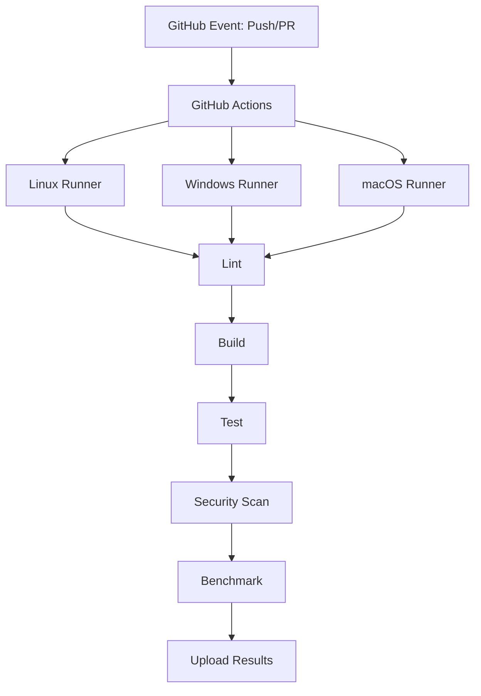
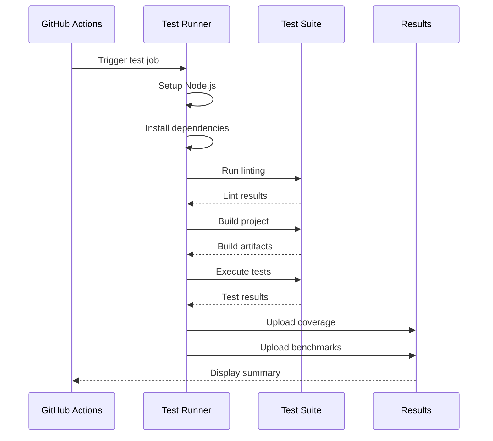

# Multi-Platform Testing for qvd4js

## 📋 Overview

This document describes the comprehensive multi-platform testing infrastructure for qvd4js, which ensures the library works reliably and securely across Windows, macOS, and Linux environments.

## 🎯 Testing Philosophy

### Goals

1. **Comprehensive Coverage**: Test all library operations (read, write, modify)
2. **Multi-Platform Support**: Validate functionality on Windows, macOS, and Linux
3. **Security Hardening**: Ensure no path traversal vulnerabilities or malicious input handling issues
4. **Performance Validation**: Track performance metrics and detect regressions
5. **Automation**: Fully automated testing via GitHub Actions

### Key Features

✅ **Multi-Platform Support**: Tests run on Ubuntu, Windows Server, and macOS (Intel & ARM64)  
✅ **Comprehensive Coverage**: Core functionality, security, validation, and advanced features  
✅ **Security Hardening**: Path traversal prevention, buffer validation, resource management  
✅ **Performance Tracking**: Baseline and regression detection across platforms  
✅ **Self-Hosted Runners**: Support for organization-specific test infrastructure  
✅ **Automated CI/CD**: GitHub Actions workflows for all scenarios

## 🏗️ Test Architecture



## 📂 Test Organization

Tests are organized by functionality in the `__tests__/` directory:

### Core Functionality

- **Reader Operations**: Parsing QVD files of various sizes, data integrity verification
- **Writer Operations**: Writing QVD files, data persistence, format correctness
- **Lazy Loading**: Memory-efficient loading with `maxRows` limit
- **Metadata Management**: File and field-level metadata access and modification
- **Backwards Compatibility**: API compatibility and legacy code support
- **Zero Value Handling**: Edge cases with zero values across different data types

### Security & Validation

- **Path Security**: Path traversal prevention, platform-specific path validation
- **Buffer Bounds Checking**: Symbol/index table validation, overflow protection
- **Input Validation**: Parameter validation for all public methods
- **Error Handling**: Custom error classes with context information
- **Resource Management**: File descriptor leak prevention, proper cleanup

### Cross-Platform Compatibility

- **Platform-Specific Behavior**: Case sensitivity, path separators, drive letters
- **Security Consistency**: Path validation across all operating systems

## 🖥️ Platform Matrix

### Supported Platforms

| Platform       | Node.js Versions | Architecture | Runner Type   |
| -------------- | ---------------- | ------------ | ------------- |
| Ubuntu 22.04   | 20, 22, 24       | x64          | GitHub-hosted |
| Windows Server | 20, 22, 24       | x64          | Self-hosted   |
| macOS 13       | 20, 22, 24       | x64, arm64   | Self-hosted   |

### Test Execution Flow



## 🔒 Security Testing

### Path Traversal Prevention

- Absolute path blocking with `allowedDir` restrictions
- Relative traversal prevention (`../../` attacks)
- Platform-specific path validation (Windows UNC paths, Unix paths)
- Null byte injection blocking

### Buffer Safety

- Symbol table overflow protection
- Index table bounds validation
- Negative offset and length rejection
- NaN value detection and handling

### Resource Protection

- File descriptor leak prevention
- Memory limit enforcement
- Proper error cleanup
- Concurrent operation safety

## 📦 Test Data

Test data files are located in `__tests__/data/`:

- **small.qvd**: Fast unit tests and basic operations
- **medium.qvd**: Larger file testing
- **large.qvd**: Performance and lazy loading tests
- **damaged.qvd**: Error handling and corruption detection

Additional test files are generated dynamically during test execution for specific security and edge case scenarios.

## 🚀 CI/CD Workflow

### Workflow Structure

**Location**: `.github/workflows/test.yml`

**Jobs**:

1. **Lint**: Code quality checks with ESLint
2. **Build**: tsup build with dual ESM/CJS artifact upload
3. **Test**: Multi-platform matrix testing (Ubuntu, Windows, macOS)
4. **Benchmark**: Performance tracking (optional, triggered manually or on main branch)
5. **Security Scan**: npm audit and Snyk integration
6. **Summary**: Aggregate results and create test summary

### Workflow Triggers

- **Push to main**: Full test suite + benchmark publishing
- **Pull Requests**: Full test suite without publishing
- **Weekly Schedule**: Sunday at midnight UTC
- **Manual Dispatch**: On-demand with Node.js version selection

## 💻 Self-Hosted Runner Setup

### Quick Setup Guides

#### Linux (Ubuntu/Debian)

```bash
# Install dependencies
sudo apt-get update
sudo apt-get install -y git curl build-essential

# Install Node Version Manager
curl -o- https://raw.githubusercontent.com/nvm-sh/nvm/v0.39.0/install.sh | bash
source ~/.bashrc

# Install Node.js versions
nvm install 20
nvm install 22
nvm install 24

# Configure runner
./config.sh --url https://github.com/YOUR-ORG/qvd4js --labels self-hosted,linux,x64
sudo ./svc.sh install
sudo ./svc.sh start
```

#### Windows (PowerShell as Administrator)

```powershell
# Install via Chocolatey
Set-ExecutionPolicy Bypass -Scope Process -Force
[System.Net.ServicePointManager]::SecurityProtocol = [System.Net.ServicePointManager]::SecurityProtocol -bor 3072
iex ((New-Object System.Net.WebClient).DownloadString('https://community.chocolatey.org/install.ps1'))

# Install dependencies
choco install git nodejs-lts nvm -y

# Install Node.js versions
nvm install 20.10.0
nvm install 22.0.0
nvm install 24.0.0

# Configure runner
./config.cmd --url https://github.com/YOUR-ORG/qvd4js --labels self-hosted,windows,x64
./run.cmd
```

#### macOS

```bash
# Install Homebrew (if not already installed)
/bin/bash -c "$(curl -fsSL https://raw.githubusercontent.com/Homebrew/install/HEAD/install.sh)"

# Install dependencies
brew install git node@20

# Install Node Version Manager
curl -o- https://raw.githubusercontent.com/nvm-sh/nvm/v0.39.0/install.sh | bash
source ~/.zshrc

# Install Node.js versions
nvm install 20
nvm install 22
nvm install 24

# Configure runner
./config.sh --url https://github.com/YOUR-ORG/qvd4js --labels self-hosted,macos,x64
./svc.sh install
./svc.sh start
```

## 🛠️ Development Workflow

### Running Tests Locally

```bash
# Run all tests with coverage
npm test

# Build the library (dual ESM/CJS output)
npm run build

# Run linting
npm run lint

# Clean build artifacts
npm run clean

# Run benchmarks
npm run bench

# Run benchmarks in CI mode (output results in JSON format)
npm run bench:ci
```

### Test Framework Stack

- **Testing**: Jest with ESM support (`NODE_OPTIONS=--experimental-vm-modules`)
- **Build**: tsup (esbuild-based, fast dual ESM/CJS builds)
- **Linting**: ESLint with Prettier integration
- **Coverage**: Built-in Jest coverage reporting
- **Benchmarking**: Custom benchmark suite with tinybench

### Adding New Tests

When adding new features or fixing bugs:

1. Write tests that cover the new functionality
2. Ensure tests pass on your local platform
3. Commit and push - CI will test across all platforms
4. Review CI results for platform-specific issues

## ❓ FAQ

**Q: Why self-hosted runners for Windows and macOS?**  
A: GitHub-hosted runners for these platforms are expensive.

**Q: Why test on multiple Node.js versions?**  
A: To ensure compatibility with current LTS (20.x) and future releases (22.x, 24.x), catching version-specific issues early.

**Q: How long do tests take?**  
A: Typically just a few seconds locally, and the full multi-platform CI suite typically completes within 15 minutes.

**Q: What about test data?**  
A: Mix of real QVD files (small, medium, large) and dynamically generated test cases for security scenarios.

**Q: How is security validated?**  
A: Dedicated security test suites for path traversal, buffer bounds, resource management, plus automated scanning (npm audit, Snyk).

**Q: Can I run tests for a specific platform only?**  
A: Yes, use the workflow dispatch option in GitHub Actions to select specific configurations.

## 📚 References

- [Jest Documentation](https://jestjs.io/)
- [GitHub Actions Documentation](https://docs.github.com/en/actions)
- [GitHub Self-Hosted Runners](https://docs.github.com/en/actions/hosting-your-own-runners)
- [tsup Documentation](https://tsup.egoist.dev/)
