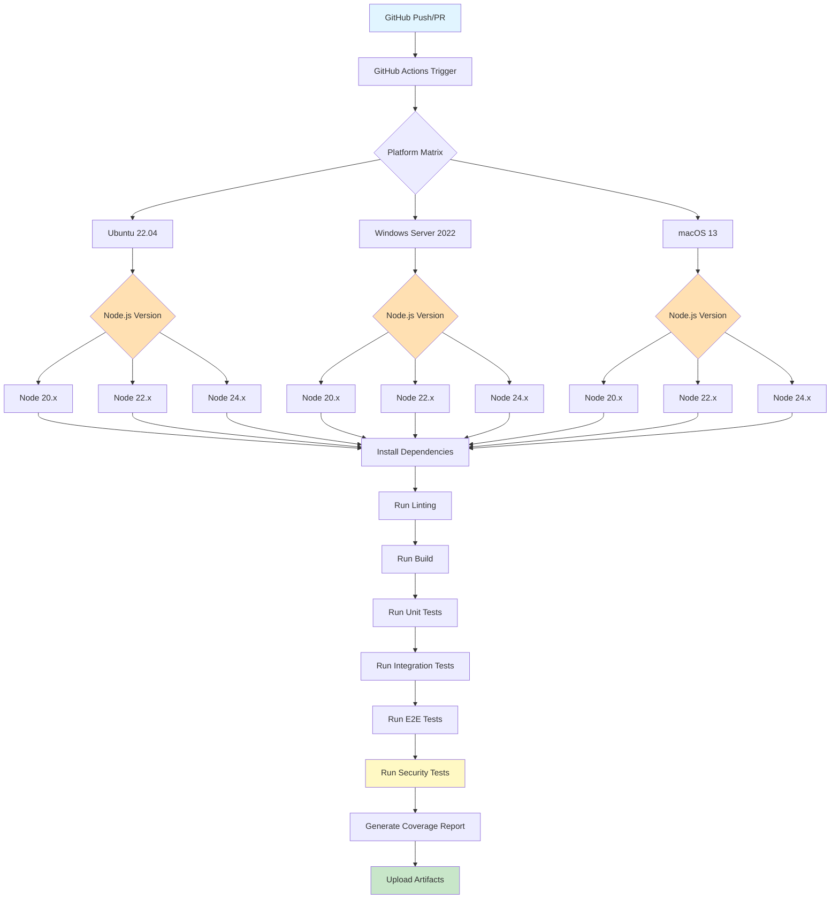
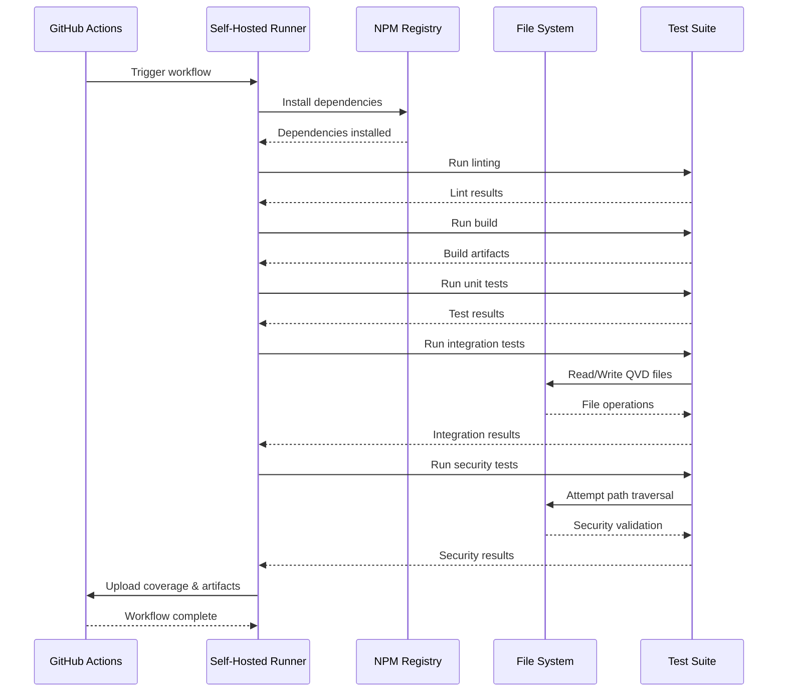

# Testing Documentation for qvd4js

## Overview

This document describes the comprehensive automated testing solution for the qvd4js library. The solution provides end-to-end testing across multiple platforms with a focus on reliability, security, and performance.

## Testing Philosophy

### Goals

1. **Comprehensive Coverage**: Test all library operations (read, write, modify)
2. **Multi-Platform Support**: Validate functionality on Windows, macOS, and Linux
3. **Security Hardening**: Ensure no path traversal vulnerabilities or malicious input handling issues
4. **Performance Validation**: Track performance metrics and detect regressions
5. **Automation**: Fully automated testing via GitHub Actions

### Key Features

- **Multi-Platform Support**: Tests run on Ubuntu, Windows Server, and macOS (Intel & ARM64)
- **Comprehensive Coverage**: Core functionality, security, validation, and advanced features
- **Security Hardening**: Path traversal prevention, buffer validation, resource management
- **Performance Tracking**: Baseline and regression detection across platforms
- **Self-Hosted Runners**: Support for organization-specific test infrastructure
- **Automated CI/CD**: GitHub Actions workflows for all scenarios

## Test Architecture



### Test Execution Flow



## Test Organization

Tests are organized by functionality in the `__tests__/` directory:

### Core Functionality Tests

**Location**: `__tests__/*.test.js`

- **Reader Operations** (`reader.test.js`): Parsing QVD files of various sizes, data integrity verification, error handling for corrupted files
- **Writer Operations** (`writer.test.js`): Writing QVD files, data persistence verification, format correctness
- **Lazy Loading** (`lazy-loading.test.js`): Loading files with `maxRows` limit, memory efficiency validation, partial data loading
- **Metadata Handling** (`metadata.test.js`): File-level and field-level metadata access and modification, metadata persistence across write operations
- **Backwards Compatibility** (`backwards-compatibility.test.js`): API compatibility verification, legacy code support, complete workflow validation (read → transform → write → verify)
- **Zero Value Handling** (`zero-value-handling.test.js`): Edge cases with zero values in different data types, symbol type handling (dual integer, dual double, pure integer, pure double)

### Security & Validation Tests

**Location**: `__tests__/*.test.js`

- **Path Security** (`path-security.test.js`): Path traversal prevention (`../../` attacks), absolute path validation with `allowedDir` restrictions, platform-specific path handling (Windows vs Unix), null byte injection blocking, security error properties and context
- **Buffer Bounds Checking** (`buffer-bounds.test.js`): Symbol table overflow protection, index table validation, negative offset and length rejection, NaN value detection, corrupted file handling
- **Input Validation** (`input-validation.test.js`): Method parameter validation (`head`, `tail`, `rows`, `at`, `select`), type checking and error messages, edge case handling
- **Error Handling** (`errors.test.js`): Custom error class hierarchy, error context information, error catching patterns, integration with real file operations
- **Resource Management** (`resource-leak.test.js`): File descriptor leak prevention, concurrent operation safety, proper cleanup on errors

### Cross-Platform Compatibility Tests

**Location**: `__tests__/cross-platform.test.js`

- Case sensitivity handling across platforms (Windows, macOS, Linux)
- Path separator normalization
- Platform-specific path features (drive letters, UNC paths)
- Security validation consistency across platforms

## Platform Coverage

### Supported Platforms

| Platform            | Node.js Versions | Architecture | Runner Type   |
| ------------------- | ---------------- | ------------ | ------------- |
| Ubuntu 22.04        | 20, 22, 24       | x64          | GitHub-hosted |
| Windows Server 2022 | 20, 22, 24       | x64          | Self-hosted   |
| macOS 13            | 20, 22, 24       | x64, arm64   | Self-hosted   |

### Node.js Version Strategy

- **Minimum**: Node.js 20.10.0 (as per package.json engines)
- **Main Target (LTS)**: Node.js 20.x - Active LTS until 2026-04-30
- **Main Target (Current)**: Node.js 22.x - Active LTS from 2024-10-29 until 2027-04-30
- **Future**: Node.js 24.x - For forward compatibility testing (Current release, enters LTS 2025-10-28)
- **Matrix**: Run full test suite on all combinations

Reference: <https://nodejs.org/en/about/previous-releases>

### Platform-Specific Considerations

#### Windows

- Path separators: `\` vs `/`
- Line endings: CRLF vs LF
- File permissions: Different from Unix
- Case sensitivity: Case-insensitive file system

#### macOS

- Both Intel (x64) and Apple Silicon (arm64) support
- Case-insensitive file system by default
- Unix-like path handling

#### Linux

- Case-sensitive file system
- Standard Unix path handling
- Primary development platform

## Security Testing

### Path Traversal Prevention

**Vulnerability**: Attacker provides malicious path to read/write files outside intended directory

**Test Coverage**:

```javascript
// Absolute path attempts
await expect(QvdDataFrame.fromQvd('/etc/passwd')).rejects.toThrow(QvdSecurityError);

// Relative path traversal
await expect(QvdDataFrame.fromQvd('../../sensitive.qvd')).rejects.toThrow(QvdSecurityError);

// Windows-style paths
await expect(QvdDataFrame.fromQvd('C:\\Windows\\System32\\config\\SAM')).rejects.toThrow(QvdSecurityError);

// URL-encoded paths
await expect(QvdDataFrame.fromQvd('%2e%2e%2f%2e%2e%2fetc%2fpasswd')).rejects.toThrow(QvdSecurityError);
```

**Implementation Strategy**:

1. Validate all file paths before operations
2. Resolve paths to absolute paths
3. Verify paths stay within allowed directories
4. Use path.normalize() and path.resolve()
5. Implement allowlist of safe directories

### Buffer Overflow Prevention

**Vulnerability**: Malformed QVD files cause buffer overflows

**Test Coverage**:

```javascript
// Oversized field names
test('Reject field names > 1MB', async () => {
  const maliciousQvd = createQvdWithOversizedField();
  await expect(QvdDataFrame.fromQvd(maliciousQvd)).rejects.toThrow(QvdParseError);
});

// Invalid symbol table sizes
test('Detect symbol table size mismatch', async () => {
  const maliciousQvd = createQvdWithInvalidSymbolSize();
  await expect(QvdDataFrame.fromQvd(maliciousQvd)).rejects.toThrow(QvdCorruptedError);
});
```

### Denial of Service Prevention

**Test Coverage**:

```javascript
test('Limit memory usage for large files', async () => {
  const memBefore = process.memoryUsage().heapUsed;
  await QvdDataFrame.fromQvd('large.qvd', {maxRows: 100});
  const memAfter = process.memoryUsage().heapUsed;
  const memDelta = memAfter - memBefore;

  expect(memDelta).toBeLessThan(100 * 1024 * 1024); // 100MB limit
});

test('Timeout for operations on corrupted files', async () => {
  await expect(withTimeout(QvdDataFrame.fromQvd('damaged.qvd'), 5000)).rejects.toThrow('Timeout');
});
```

## Test Data

Test data files are located in `__tests__/data/`:

| File        | Purpose                        |
| ----------- | ------------------------------ |
| small.qvd   | Fast unit tests                |
| medium.qvd  | Medium-scale integration tests |
| large.qvd   | Performance and lazy loading   |
| damaged.qvd | Error handling and corruption  |

Additional test files are generated dynamically during test execution for specific security and edge case scenarios.

## CI/CD Workflow

### Workflow Structure

**Location**: `.github/workflows/test.yml`

**Jobs**:

1. **Lint**: Code quality checks with ESLint
2. **Build**: tsup build with dual ESM/CJS artifact upload
3. **Test**: Multi-platform matrix testing (Ubuntu, Windows, macOS)
4. **Benchmark**: Performance tracking (optional, triggered manually or on main branch)
5. **Security Scan**: npm audit and Snyk integration
6. **Summary**: Aggregate results and create test summary

### Workflow Triggers

- **Push to main**: Full test suite + benchmark publishing
- **Pull Requests**: Full test suite without publishing
- **Weekly Schedule**: Sunday at midnight UTC
- **Manual Dispatch**: On-demand with Node.js version selection

## Self-Hosted Runner Setup

### Software Requirements

#### All Platforms

- Git 2.x+
- Node.js 20.10.0+ (via nvm/nvs recommended)
- npm 10+
- GitHub Actions Runner (latest)

### Quick Setup Guides

#### Linux (Ubuntu/Debian)

```bash
# Install required packages
sudo apt-get update
sudo apt-get install -y git curl build-essential

# Install Node.js via nvm
curl -o- https://raw.githubusercontent.com/nvm-sh/nvm/v0.39.0/install.sh | bash
source ~/.bashrc
nvm install 20
nvm install 22
nvm install 24

# Download and configure GitHub Actions runner
mkdir actions-runner && cd actions-runner
curl -o actions-runner-linux-x64-2.311.0.tar.gz -L \
  https://github.com/actions/runner/releases/download/v2.311.0/actions-runner-linux-x64-2.311.0.tar.gz
tar xzf ./actions-runner-linux-x64-2.311.0.tar.gz
./config.sh --url https://github.com/YOUR-ORG/qvd4js --token <TOKEN> --labels self-hosted-linux
sudo ./svc.sh install
sudo ./svc.sh start
```

#### Windows (PowerShell as Administrator)

```powershell
# Install Chocolatey
Set-ExecutionPolicy Bypass -Scope Process -Force
[System.Net.ServicePointManager]::SecurityProtocol = [System.Net.ServicePointManager]::SecurityProtocol -bor 3072
iex ((New-Object System.Net.WebClient).DownloadString('https://community.chocolatey.org/install.ps1'))

# Install required software
choco install git -y
choco install nodejs-lts -y
choco install nvm -y

# Install multiple Node.js versions
nvm install 20.10.0
nvm install 22.0.0
nvm install 24.0.0

# Download and configure GitHub Actions runner
mkdir actions-runner; cd actions-runner
Invoke-WebRequest -Uri https://github.com/actions/runner/releases/download/v2.311.0/actions-runner-win-x64-2.311.0.zip -OutFile actions-runner-win-x64-2.311.0.zip
Expand-Archive -Path actions-runner-win-x64-2.311.0.zip -DestinationPath .
./config.cmd --url https://github.com/YOUR-ORG/qvd4js --token <TOKEN> --labels self-hosted-windows
./run.cmd
```

#### macOS (Intel and Apple Silicon)

```bash
# Install Homebrew
/bin/bash -c "$(curl -fsSL https://raw.githubusercontent.com/Homebrew/install/HEAD/install.sh)"

# Install required software
brew install git node@20

# Install nvm for multiple Node.js versions
curl -o- https://raw.githubusercontent.com/nvm-sh/nvm/v0.39.0/install.sh | bash
source ~/.zshrc
nvm install 20
nvm install 22
nvm install 24

# Download and configure GitHub Actions runner
mkdir actions-runner && cd actions-runner
curl -o actions-runner-osx-x64-2.311.0.tar.gz -L \
  https://github.com/actions/runner/releases/download/v2.311.0/actions-runner-osx-x64-2.311.0.tar.gz
tar xzf ./actions-runner-osx-x64-2.311.0.tar.gz
./config.sh --url https://github.com/YOUR-ORG/qvd4js --token <TOKEN> --labels self-hosted-macos
./svc.sh install
./svc.sh start
```

### Runner Labels

Configure runners with descriptive labels:

- `self-hosted` (automatic)
- `self-hosted-linux`, `self-hosted-windows`, `self-hosted-macos`
- OS-specific: `ubuntu-22.04`, `windows-2022`, `macos-13`
- Architecture: `x64`, `arm64`

### Security Considerations for Self-Hosted Runners

1. **Isolation**: Run each runner in a separate VM or container
2. **Network**: Restrict outbound network access
3. **Credentials**: Never store secrets in runner environment
4. **Updates**: Keep runner software up to date
5. **Monitoring**: Log all runner activity
6. **Cleanup**: Clear workspace after each job

## Development Workflow

### Running Tests Locally

```bash
# Run all tests with coverage
npm test

# Build the library (dual ESM/CJS output)
npm run build

# Run linting
npm run lint

# Clean build artifacts
npm run clean

# Run benchmarks
npm run bench

# Run benchmarks in CI mode
npm run bench:ci
```

### Test Framework Stack

- **Testing**: Jest with ESM support (`NODE_OPTIONS=--experimental-vm-modules`)
- **Build**: tsup (esbuild-based, fast dual ESM/CJS builds)
- **Linting**: ESLint with Prettier integration
- **Coverage**: Built-in Jest coverage reporting
- **Benchmarking**: Custom benchmark suite with tinybench

### Adding New Tests

When adding new features or fixing bugs:

1. Write tests that cover the new functionality
2. Ensure tests pass on your local platform
3. Commit and push - CI will test across all platforms
4. Review CI results for platform-specific issues

## FAQ

**Q: Why self-hosted runners for Windows and macOS?**  
A: GitHub-hosted runners for these platforms are expensive.

**Q: Why test on multiple Node.js versions?**  
A: To ensure compatibility with current LTS (20.x) and future releases (22.x, 24.x), catching version-specific issues early.

**Q: What about test data?**  
A: Mix of real QVD files (small, medium, large) and dynamically generated test cases for security scenarios.

**Q: How is security validated?**  
A: Dedicated security test suites for path traversal, buffer bounds, resource management, plus automated scanning (npm audit, Snyk).

**Q: Can I run tests for a specific platform only?**  
A: Yes, use the workflow dispatch option in GitHub Actions to select specific configurations.

## References

- [Jest Documentation](https://jestjs.io/)
- [GitHub Actions Documentation](https://docs.github.com/en/actions)
- [GitHub Self-Hosted Runners](https://docs.github.com/en/actions/hosting-your-own-runners)
- [tsup Documentation](https://tsup.egoist.dev/)
