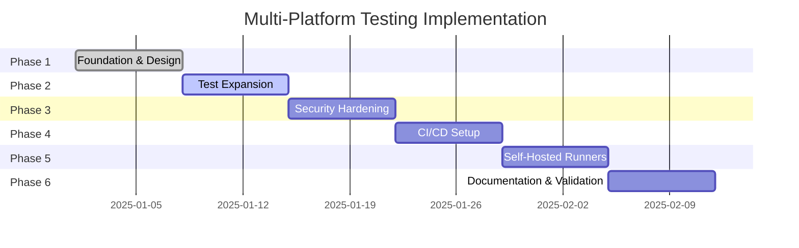

# Multi-Platform Testing Solution - Executive Summary

## 📋 Quick Overview

This document provides a high-level summary of the comprehensive multi-platform testing solution designed for qvd4js. For complete details, see [MULTI_PLATFORM_TEST_DESIGN.md](./MULTI_PLATFORM_TEST_DESIGN.md).

## 🎯 Solution Highlights

### What We're Building

A fully automated, multi-platform testing infrastructure that ensures qvd4js works reliably and securely across Windows, macOS, and Linux.

### Key Features

✅ **Multi-Platform Support**: Tests run on Ubuntu, Windows Server, and macOS  
✅ **Comprehensive Coverage**: Unit, integration, E2E, security, and performance tests  
✅ **Security Hardening**: Path traversal prevention, malicious input handling  
✅ **Performance Tracking**: Baseline and regression detection across platforms  
✅ **Self-Hosted Runners**: Support for organization's own test infrastructure  
✅ **Automated CI/CD**: GitHub Actions workflows for all scenarios  

## 🏗️ Architecture at a Glance

```
GitHub Event (Push/PR)
         ↓
   GitHub Actions
         ↓
   ┌─────┴─────┐
   ↓     ↓     ↓
 Linux Windows macOS
   ↓     ↓     ↓
 Lint→Build→Test→Security→Coverage
         ↓
   Upload Results
```

## 📊 Test Coverage Breakdown

| Test Type      | Count | Purpose                                    |
| -------------- | ----- | ------------------------------------------ |
| Unit Tests     | 95+   | Core functionality validation              |
| Integration    | 15+   | Read/write/modify operations               |
| E2E            | 10+   | Complete workflows                         |
| Security       | 20+   | Path traversal, malicious input, DoS       |
| Performance    | 10+   | Benchmarking and regression detection      |
| **Total**      | **150+** | **Comprehensive coverage across platforms** |

## 🖥️ Platform Matrix

| Platform         | Node.js | Architecture | Runner Type   |
| ---------------- | ------- | ------------ | ------------- |
| Ubuntu 22.04     | 20, 22  | x64          | Self-hosted   |
| Windows Server   | 20, 22  | x64          | Self-hosted   |
| macOS 13         | 20, 22  | x64, arm64   | Self-hosted   |

**Total Configurations**: 6+ (3 OS × 2 Node versions)

## 🔒 Security Testing Focus

### Critical Security Tests

1. **Path Traversal Prevention**
   - Absolute path attempts (`/etc/passwd`)
   - Relative traversal (`../../sensitive.qvd`)
   - Windows paths (`C:\Windows\System32\...`)
   - URL-encoded paths

2. **Malicious Input Handling**
   - Corrupted QVD files
   - Oversized field names (>1MB)
   - XML injection attempts
   - Buffer overflow prevention

3. **Resource Limits**
   - Memory usage caps
   - Operation timeouts
   - DoS prevention

## 📦 Test Data Strategy

### Current Test Files
- `small.qvd` (29KB, 606 rows) - Fast unit tests
- `medium.qvd` (901KB, 18k rows) - Integration tests
- `large.qvd` (1MB, 60k rows) - Performance tests
- `damaged.qvd` (20KB) - Error handling

### Additional Files Needed
- `empty.qvd` - Zero rows edge case
- `all_types.qvd` - All symbol types
- `unicode.qvd` - Special characters
- `malformed_*.qvd` - Security testing
- Plus 6 more specialized test files

## 🚀 Implementation Timeline



**Estimated Timeline**: 6 weeks from design to full implementation

## 💻 Self-Hosted Runner Setup

### Quick Setup (Per Platform)

**Linux**:
```bash
# Install dependencies
sudo apt-get install git curl build-essential
curl -o- https://raw.githubusercontent.com/nvm-sh/nvm/v0.39.0/install.sh | bash
nvm install 20 && nvm install 22

# Configure runner
./config.sh --url https://github.com/mountaindude/qvd4js --labels self-hosted-linux
sudo ./svc.sh install && sudo ./svc.sh start
```

**Windows**:
```powershell
# Install via Chocolatey
choco install git nodejs-lts nvm -y
nvm install 20.10.0 && nvm install 22.0.0

# Configure runner
./config.cmd --url https://github.com/mountaindude/qvd4js --labels self-hosted-windows
./run.cmd
```

**macOS**:
```bash
# Install via Homebrew
brew install git node@20
curl -o- https://raw.githubusercontent.com/nvm-sh/nvm/v0.39.0/install.sh | bash
nvm install 20 && nvm install 22

# Configure runner
./config.sh --url https://github.com/mountaindude/qvd4js --labels self-hosted-macos
./svc.sh install && ./svc.sh start
```

### Hardware Requirements

| Component | Minimum  | Recommended |
| --------- | -------- | ----------- |
| CPU       | 2 cores  | 4+ cores    |
| RAM       | 4 GB     | 8+ GB       |
| Disk      | 50 GB    | 100+ GB     |
| Network   | 10 Mbps  | 100+ Mbps   |

## 🔄 GitHub Actions Workflow

### Main Workflow (`.github/workflows/test.yml`)

```yaml
on: [push, pull_request]

jobs:
  lint:      # Code quality check
  build:     # Build artifacts
  test:      # Multi-platform test matrix
  security:  # Security scanning
  coverage:  # Coverage reporting
```

### Self-Hosted Workflow (`.github/workflows/test-self-hosted.yml`)

```yaml
on: [push, pull_request]

jobs:
  test-self-hosted:
    runs-on: [self-hosted-linux, self-hosted-windows, self-hosted-macos]
    strategy:
      matrix:
        node: ['20.x', '22.x']
```

## 📈 Success Metrics

### Coverage Targets
- ✅ Unit Test Coverage: **95%+**
- ✅ Platform Coverage: **3 OS × 2 Node versions = 6 configs**
- ✅ Build Success Rate: **>95%**
- ✅ Test Execution Time: **<10 minutes**

### Quality Goals
- 🎯 Zero high-severity security vulnerabilities
- 🎯 Zero platform-specific bugs in production
- 🎯 Performance regression alerts (>10% degradation)
- 🎯 Comprehensive test documentation

## 📚 Developer Experience

### Running Tests Locally

```bash
# All tests
npm test

# Specific categories
npm run test:unit
npm run test:integration
npm run test:e2e
npm run test:security
npm run test:performance

# With coverage
npm run coverage

# Watch mode
npm run test:watch
```

### CI/CD Flow

```
Developer Push
     ↓
Automated Tests (All Platforms)
     ↓
Security Scan
     ↓
Coverage Report
     ↓
✅ Success → Merge Allowed
❌ Failure → Block Merge
```

## 🛡️ Security Best Practices

1. **Path Validation**: All file paths validated before operations
2. **Input Sanitization**: XML and buffer content sanitized
3. **Resource Limits**: Memory and timeout caps enforced
4. **Dependency Scanning**: Regular npm audit and Snyk scans
5. **Isolated Runners**: Each runner in separate VM/container

## 📖 Documentation

- **[Complete Design](./MULTI_PLATFORM_TEST_DESIGN.md)** - Full technical specification (942 lines)
- **[Documentation Index](./README.md)** - Navigation guide
- **[This Summary](./TESTING_SUMMARY.md)** - Quick overview

## 🤝 Getting Started

### For Developers
1. Review this summary
2. Read the [complete design document](./MULTI_PLATFORM_TEST_DESIGN.md)
3. Explore existing tests in `__tests__/`
4. Follow test patterns and conventions

### For DevOps
1. Review [self-hosted runner requirements](./MULTI_PLATFORM_TEST_DESIGN.md#self-hosted-runner-requirements)
2. Set up runners per platform
3. Configure GitHub Actions workflows
4. Monitor test execution and results

### For Contributors
1. Understand the test architecture
2. Write tests for new features
3. Ensure security best practices
4. Maintain >95% coverage

## ❓ FAQ

**Q: Why self-hosted runners?**  
A: Organization can provide actual OS environments with specific configurations and better control.

**Q: Why test on multiple Node.js versions?**  
A: Ensure compatibility with current LTS (20.x) and future releases (22.x).

**Q: How long do tests take?**  
A: Target <10 minutes for full suite across all platforms.

**Q: What about test data?**  
A: Mix of real QVD files and synthetically generated test cases.

**Q: How is security validated?**  
A: Dedicated security test suite + automated scanning (npm audit, Snyk).

## 🎉 Benefits

### For Users
- ✅ Reliable library across all platforms
- ✅ Security-hardened code
- ✅ Performance validated

### For Developers
- ✅ Catch bugs early in CI/CD
- ✅ Clear test patterns to follow
- ✅ Automated regression detection

### For Organization
- ✅ Quality assurance automation
- ✅ Security compliance
- ✅ Platform coverage validation

---

**Next Steps**: Review the [complete design document](./MULTI_PLATFORM_TEST_DESIGN.md) for implementation details.

**Questions?** Open an issue or contact the maintainers.

---

**Last Updated**: 2025-10-22  
**Version**: 1.0  
**Status**: ✅ Design Complete - Ready for Implementation
